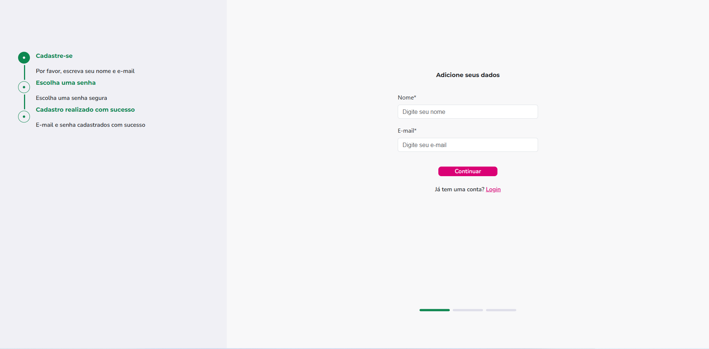
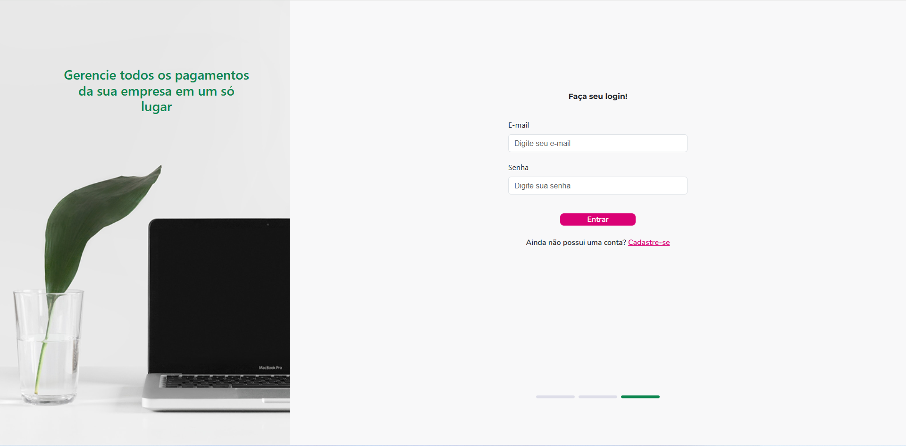
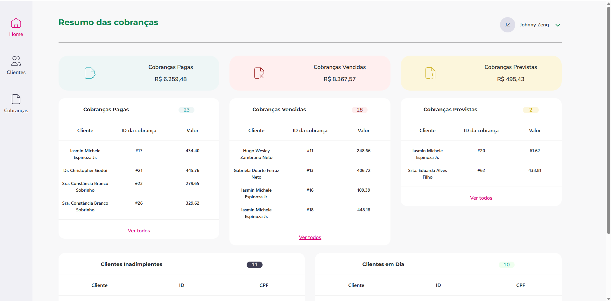
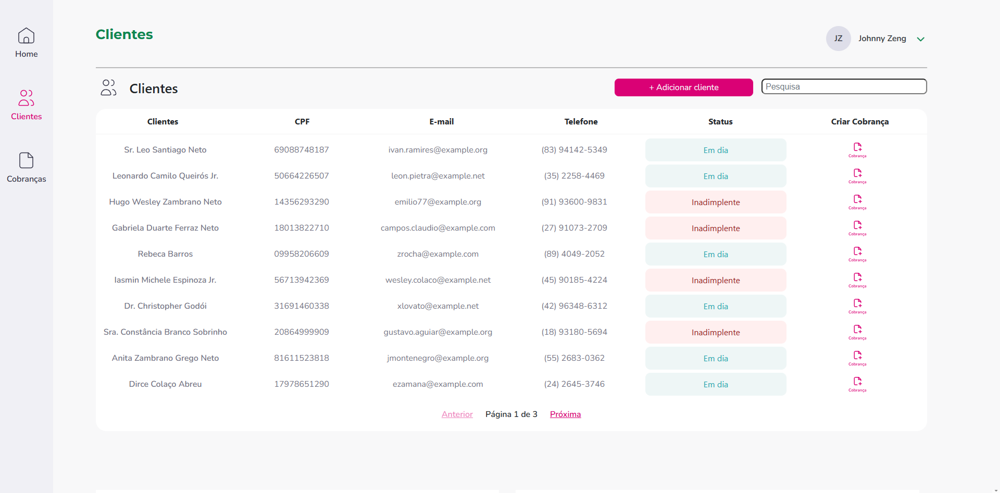
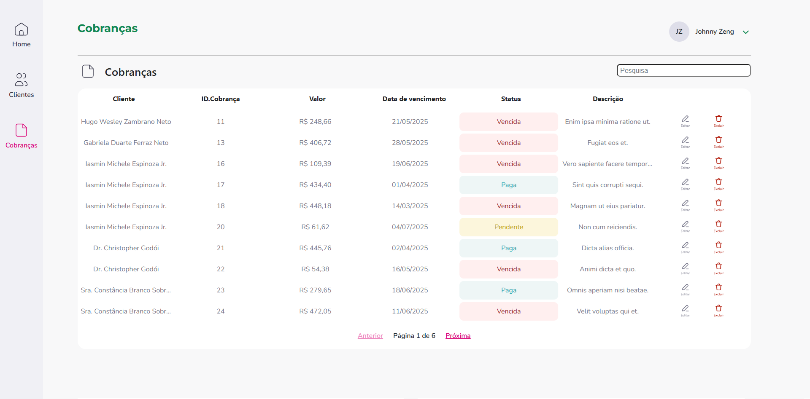

    

Meu Projeto Pessoal: Cubos - PHP
Este repositório contém um projeto pessoal desenvolvido com Laravel (PHP) no back-end e JavaScript no front-end. O objetivo deste projeto foi criar um sistema de CRM (Customer Relationship Management) para treinar operações CRUD (Create, Read, Update, Delete) em entidades como Clientes, Cobranças e Usuários.

Tecnologias Utilizadas:

Back-end: Laravel (PHP)

Eloquent ORM para interação com o banco de dados.

Sistema de roteamento e controladores.

Autenticação e autorização (se aplicável).

APIs RESTful para comunicação com o front-end (se aplicável).

Front-end: JavaScript

Ferramentas de Build: Vite

Estilização: Tailwind CSS e Bootstrap

Requisições HTTP: Axios

Máscaras de Input: IMask e Inputmask

Manipulação do DOM para interatividade.

Requisições assíncronas (AJAX/Fetch API) para consumir as APIs do Laravel.

Funcionalidades Principais:

Gerenciamento de Clientes: Criação, visualização, edição e exclusão de registros de clientes.

Gestão de Cobranças: Adição, consulta, atualização e remoção de informações de cobranças associadas aos clientes.

Administração de Usuários: Cadastro, listagem e gerenciamento de usuários do sistema.

Autenticação de usuários (registro e login).

Filtragem e busca de dados.

Interface responsiva para diferentes dispositivos.

### **Como Rodar o Projeto Localmente:**

1. **Clone o repositório:**  
   git clone git@github.com:JoZeng/cubos-php.git  
   cd cubos-php

2. **Instale as dependências do Composer:**  
   composer install

3. **Copie o arquivo de ambiente e gere a chave da aplicação:**  
   cp .env.example .env  
   php artisan key:generate

Configure o banco de dados no arquivo .env:

Defina as credenciais para seu banco de dados (MySQL, PostgreSQL, SQLite, etc.).

Para este projeto, as configurações são:

DB_CONNECTION=mysql
DB_HOST=127.0.0.1
DB_PORT=3306
DB_DATABASE=cubos
DB_USERNAME=root
DB_PASSWORD=

5. **Execute as migrações do banco de dados:**  
   php artisan migrate

Se você tiver seeders para dados de teste: php artisan db:seed

Instale as dependências do Node.js e compile os assets (se aplicável):

npm install
npm run dev # ou npm run build para produção

7. **Inicie o servidor de desenvolvimento do Laravel:**  
   php artisan serve

O projeto estará acessível em http://127.0.0.1:8000 (ou a porta indicada).
